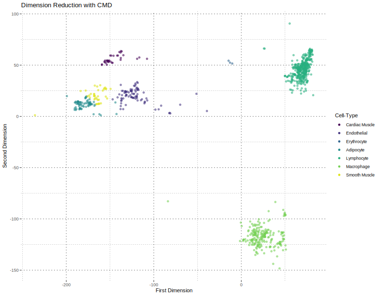
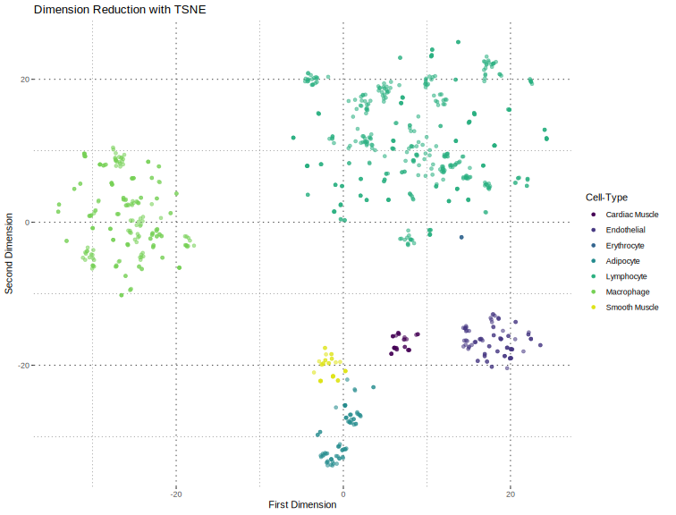
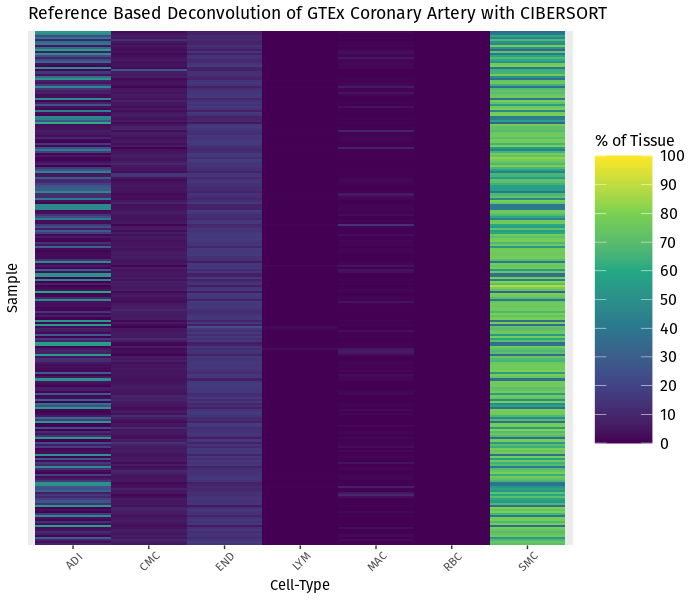

Deconvolution Workflow: CIBERSORT
================
Zachary Brehm
3/3/2021

## Introduction

This repository outlines the steps of a workflow to perform
deconvolution of tissue gene expression data with
[CIBERSORT](https://cibersort.stanford.edu/). Deconvolution methods are
used to gain insight into the composition of whole tissue samples. A
tissue is made of many different cell-types, and each cell-type
expresses unique genes indicative of their functions. Knowledge of how
much of each cell is present in a tissue can assist with differential
expression analyses.

CIBERSORT is one such method that estimates the proportion of each
cell-type found in a tissue. CIBERSORT requires 3 inputs.

-   **Reference** data, **R***i* × *j*, a matrix of *i* genes
    by *j* samples of cell-type specific gene expression. Each cell-type
    that we are interested in estimating in the tissue should be present
    among these samples.

-   **Mixture** data, **M***i* × *k*, a matrix of *i* genes
    by *k* samples of whole tissue gene expression. These are the
    samples we will deconvolute.

-   A **phenotype** indication table, **P***h* × *j*, a
    matrix of *h* cell-types by *j* samples. The columns here must match
    to the samples in the reference data. Here, entry
    *p**m*, *n* = 1 if sample *n* is of cell-type *m*,
    otherwise it will equal 2.

All data used for this example was obtained with
[recount3](https://bioconductor.org/packages/release/bioc/html/recount3.html).
For the mixture data, we use coronary artery samples from
[GTEx](https://www.gtexportal.org/home/), and the reference samples are
from cell-types found in atherosclerotic artery. Atherosclerosis is a
disease which is strongly characterized by compositional changes in
tissue. As this disease progresses, plaques develop along the inside of
the artery, causing health complications or death. The nature of this
disease makes it a natural candidate for deconvolution. For example, in
a differential expression analyses, we would like to investigate whether
shifts in gene expression can be attributed to differences in form
between samples or differences in function between samples. For our
purposes, we will use the following cell-types:

-   Smooth muscle cells
-   Endothelial cells
-   Erythrocytes
-   Macrophages
-   Lymphocytes
-   Adipocytes
-   Cardiac muscle cells

## Preprocessing

This folder contains scripts to batch correct the reference data and
reduce the dimensions of these data for plotting. Since our reference
data are from numerous different experiments, this step estimates and
removes technical variation so we can better represent the underlying
biology that we wish to estimate. The batch correction step is performed
with `RUVr` from the
[RUVSeq](https://bioconductor.org/packages/release/bioc/html/RUVSeq.html)
package. This script takes in the reference data that was acquired with
`recount` and outputs a batch corrected version of the summarized
experiment object.

We also want to plot the data to see if the samples from each cell-type
are reasonably similar to one another. To do so, we calculate the
pairwise euclidean distance between samples. This distance matrix is
then used for a dimension reduction step to allow for plotting in a
plane, and is demonstrated with both the multidimensional scaling and
TSNE methods from with `cmdscale` in base R and `Rtsne` from the `Rtsne`
package. The following plots serve as example results using each method.
These are presented as static images here, but with the `plotly`
package, we can create interactive plots and mouse over the points to
identify which study the samples come from. These are saved as html
files in the preprocessing folder.

## CIBERSORT

The cibersort directory contains the script ciber\_heat.R, used to
prepare the reference and mixture data for a deconvolution using the
CIBERSORT method linked above. There is also a script used to create a
heatmap displaying the proportion of the GTEx artery samples attributed
to each cell-type in the reference data. An example of this plot
follows.

-   Smooth muscle cells are the most abundant cell-type. Smooth muscle
    cells are the primary cell-type found in coronary artery, as they
    are a main structural component of the artery itself.

-   Endothelial cells line the interior of the artery, so they are
    consistently found in small amounts across all samples.

-   Erythrocytes are essentially nonexistant, which we expect to see
    given that these samples are washed so little blood should remain in
    them.

-   Macrophages and lymphocytes are the main indicators of inflammation
    and disease in these samples, weighted towards macrophages in
    particular. They appear in small amounts more less consistently than
    endothelial cells.

-   Adipose tissue and cardiac muscle are not apart of a typical
    coronary artery, but appear here since the GTEx samples present with
    some excess tissue attached that was not trimmed off when harvested.
    This is made apparent by the sporadic and sometimes large amounts of
    adipose signal in the heatmap. Cardiac muscle appears in small
    amounts more consistently, but as muscle tissue it shares some
    similar characteristics with smooth muscle, making it difficult to
    completely isolate these cell-types away from one another.
